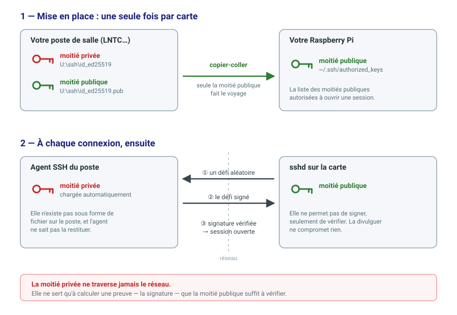

# Créer et utiliser sa clé SSH pour le développement à distance

*Contexte : postes Windows 11 en domaine Active Directory avec disque personnel
`U:`, cartes Raspberry Pi jointes par leur nom réseau — les salles du BTS CIEL.*

Ce document vous guide dans la mise en place de votre identité SSH personnelle,
pour travailler sur votre carte Raspberry Pi depuis n'importe quel poste des
salles, sans jamais saisir de mot de passe.

À faire **une seule fois dans l'année**. Comptez dix minutes.

---

## 1. Pourquoi une clé plutôt qu'un mot de passe

Vous allez développer en **remote** : VS Code s'exécute sur le PC de la salle,
mais le code, la compilation et l'exécution ont lieu sur votre carte. Derrière,
VS Code ouvre et referme des connexions SSH en permanence — à chaque
enregistrement, à chaque compilation, à chaque perte de réseau.

Avec un mot de passe, il faudrait le retaper à chacune de ces connexions.
C'est tout simplement impraticable. La clé n'est donc pas ici un raffinement
de sécurité : c'est ce qui rend le travail possible.

Elle apporte en prime ce qu'un mot de passe ne sait pas faire :

- votre mot de passe **ne circule jamais** sur le réseau ;
- une clé de 256 bits ne se devine pas, là où un mot de passe se teste ;
- vous pouvez révoquer une clé sans changer quoi que ce soit d'autre.

## 2. Le principe, en trois phrases

Vous générez une **paire** de clés : une moitié **privée** et une moitié
**publique**. Ce qui est chiffré ou signé par l'une ne se vérifie qu'avec
l'autre. C'est pour cela qu'on parle de cryptographie **asymétrique**.

Pensez à un billet de banque déchiré en deux dans les westerns : chacun garde
sa moitié, et seule la réunion des deux prouve qu'on a affaire à la bonne
personne.

| Moitié | Où elle va | Peut-elle être divulguée ? |
|---|---|---|
| **publique** (`id_ed25519.pub`) | sur la machine où vous voulez vous connecter | oui, c'est son rôle |
| **privée** (`id_ed25519`) | reste chez vous, ne voyage **jamais** | non, jamais, sous aucun prétexte |

Au moment de la connexion, le serveur envoie un défi aléatoire. Votre poste le
**signe** avec la moitié privée, le serveur vérifie la signature avec la moitié
publique qu'il détient. Votre clé privée n'a pas été transmise : elle a servi à
calculer une preuve, ce qui n'est pas la même chose.



## 3. Comment c'est organisé dans les salles

Vous changez de poste d'une séance à l'autre. Votre identité doit donc vous
suivre, sans pour autant se répandre sur les machines.

| Où | Quoi |
|---|---|
| `U:\ssh\` | votre **archive** : la paire de clés, sur votre espace personnel, qui vous suit d'un poste à l'autre |
| l'**agent SSH** du poste | votre clé privée en service, sous forme chiffrée, chargée automatiquement à l'ouverture de session |
| `U:\ssh\known_hosts` | la liste des machines distantes que vous avez reconnues |

Conséquence importante : **sur un poste, votre clé privée n'existe pas sous
forme de fichier.** Elle est confiée à un service du système — l'agent — qui
sait s'en servir pour signer, mais ne sait pas la restituer. Même vous ne
pouvez pas l'en ressortir.

Sur tous les autres postes de la salle, vous n'aurez **rien à faire** : votre
clé est chargée toute seule à l'ouverture de votre session.

> **À savoir, et ce n'est pas un détail.** L'archive dans votre espace
> personnel est lisible par l'équipe pédagogique, comme le reste de votre
> `perso`. Cette clé est donc une clé **de travail du lycée**. Pour votre
> compte GitHub ou votre serveur personnel, créez une **autre** clé, qui n'a
> rien à faire sur `U:`. Une clé par usage : c'est la règle professionnelle.

---

## 4. Étape A — créer votre identité

À faire une fois dans l'année, sur n'importe quel poste de la salle.

Ouvrez un terminal **PowerShell sans élévation** (pas « en tant
qu'administrateur »).

### A.1 Générer la paire

```
ssh-keygen -t ed25519 -C "<votre_login>@btssn"
```

Trois fois **Entrée** : emplacement par défaut, puis une passphrase vide et sa
confirmation.

Le `-C` donne un commentaire à votre clé. Sans lui, le système en invente un
qui contient un antislash et le nom du poste — source d'ennuis plus tard.

Vous obtenez deux fichiers dans `C:\Users\<login>\.ssh\` :

```
id_ed25519         votre moitié privée
id_ed25519.pub     votre moitié publique
```

### A.2 Archiver la paire sur votre espace personnel

```
mkdir U:\ssh
```

```
cp .ssh/* U:\ssh
```

```
ls U:\ssh
```

⚠️ **Vérifiez les tailles affichées.** Vous devez voir environ **400 octets**
pour la clé privée et **100 octets** pour la publique. Une taille de `0` signifie
que la copie a échoué : recommencez avant d'aller plus loin, sinon vous
perdrez votre identité au premier changement de poste.

### A.3 Confier la clé à l'agent, puis effacer le fichier

```
ssh-add .ssh\id_ed25519
```

Réponse attendue : `Identity added`.

```
del .ssh\id_ed25519
```

```
ssh-add -l
```

Vous devez voir l'empreinte de votre clé s'afficher, **alors que le fichier
n'existe plus**. C'est exactement le but : la clé est en service, mais elle
n'est plus posée en clair sur le disque d'un PC partagé.

---

## 5. Étape B — déclarer votre clé sur votre carte

À refaire **à chaque fois que vous réécrivez votre carte**, puisqu'une carte
neuve ne vous connaît pas.

Votre carte porte un **nom réseau** attribué par le serveur DHCP, de la forme
`cm501` à `cm515`. C'est par ce nom que vous vous y connectez, jamais par une
adresse IP. Dans les exemples qui suivent, remplacez `cm507` par le nom de la
vôtre.

### B.1 Afficher votre moitié publique et la copier

```
cat U:\ssh\id_ed25519.pub
```

Sélectionnez la ligne entière et copiez-la. Elle ressemble à ceci :

```
ssh-ed25519 AAAAC3NzaC1lZDI1NTE5AAAAINpD9MHiMGy5+oDSc2eAZf/zT0VOfviWfY1jof1k9l8V dupont@btssn
```

### B.2 Ouvrir une session sur la carte

```
ssh pi@cm507
```

Deux questions vous sont posées, **et la première mérite votre attention** :

```
The authenticity of host 'cm507 (192.168.1.107)' can't be established.
ED25519 key fingerprint is SHA256:9pQ3tRvXkL2mNbY7cWfH4sJd8ZaEuTgV1oKxPiCnQmY.
Are you sure you want to continue connecting (yes/no/[fingerprint])?
```

Votre poste vous dit qu'il ne connaît pas cette machine et vous demande si vous
lui faites confiance. **Ce n'est pas une formalité** : c'est le moment précis où
vous décidez qu'à cette adresse se trouve bien votre carte, et non celle de
quelqu'un d'autre qui aurait pris sa place.

Vous êtes dans la situation privilégiée de pouvoir le **vérifier** : votre carte
est devant vous. Sur sa console, affichez son empreinte :

```sh
ssh-keygen -lf /etc/ssh/ssh_host_ed25519_key.pub
```

Comparez, puis seulement alors répondez `yes`. Ensuite, saisissez le mot de
passe du compte de la carte — **la dernière fois que vous le taperez.**

### B.3 Sur la carte, créer son propre jeu de clés

```sh
ssh-keygen -t ed25519
```

Votre carte aussi peut avoir besoin d'une identité, pour se connecter ailleurs
— un dépôt Git, par exemple. Cette commande crée au passage le dossier `~/.ssh`
avec les droits corrects.

### B.4 Déposer votre moitié publique

Collez la ligne relevée en B.1 :

```sh
echo "ssh-ed25519 AAAA… dupont@btssn" > ~/.ssh/authorized_keys
```

```sh
chmod 600 ~/.ssh/authorized_keys
```

Le fichier `authorized_keys` est la liste des moitiés publiques autorisées à se
connecter à ce compte. Vous venez d'y inscrire la vôtre.

⚠️ `>` **écrase** le fichier. Pour **ajouter** une clé sans effacer les autres —
celle de votre binôme, par exemple — utilisez `>>`.

⚠️ Le `chmod` n'est pas décoratif. Si ce fichier est accessible à d'autres
utilisateurs, `sshd` **l'ignore sans le dire**, et vous chercherez longtemps.

### B.5 Vérifier

```sh
exit
```

```
ssh pi@cm507
```

Vous devez entrer **sans qu'aucun mot de passe ne soit demandé**.

**Regardez les deux moitiés côte à côte** avant de passer à la suite : sur la
carte, `cat ~/.ssh/authorized_keys` ; sur le PC, `cat U:\ssh\id_ed25519.pub`.
Les deux lignes sont identiques — le billet est reconstitué. Et remarquez que
la moitié **privée**, elle, n'a jamais quitté votre poste, et n'y existe même
plus sous forme de fichier.

---

## 6. Étape C — sur un autre poste de la salle

**Rien à faire.** Ouvrez votre session, puis vérifiez :

```
ssh-add -l
```

Votre empreinte est là : elle a été chargée automatiquement depuis `U:`.

```
ssh pi@cm507
```

Ni mot de passe, ni question sur l'empreinte — cette machine figure déjà dans
votre `known_hosts`, qui vous suit lui aussi.

---

## 7. Étape D — après avoir réécrit votre carte

Une carte réécrite a une **nouvelle identité**. Votre poste s'en aperçoit et
refuse la connexion :

```
@@@@@@@@@@@@@@@@@@@@@@@@@@@@@@@@@@@@@@@@@@@@@@@@@@@@@@@@@@@
@    WARNING: REMOTE HOST IDENTIFICATION HAS CHANGED!     @
@@@@@@@@@@@@@@@@@@@@@@@@@@@@@@@@@@@@@@@@@@@@@@@@@@@@@@@@@@@
```

**C'est le comportement attendu, et c'est une bonne nouvelle** : cet
avertissement est exactement ce qui vous protégerait si quelqu'un se faisait
passer pour votre carte. Ici, vous savez pourquoi elle a changé, donc vous
retirez l'ancienne signature en connaissance de cause :

```
ssh-keygen -R cm507 -f U:\ssh\known_hosts
```

⚠️ Le `-f` est **indispensable**. Sans lui, la commande travaille sur un autre
fichier, dans le profil local du poste, et vous croirez qu'elle n'a rien fait.

Reprenez ensuite à l'**étape B** : une carte neuve n'a plus votre clé publique.

---

## 8. En cas de problème

| Symptôme | Cause | Que faire |
|---|---|---|
| `The agent has no identities` | l'agent n'a pas votre clé | vérifiez `ls U:\ssh` ; si l'archive est là, fermez et rouvrez votre session |
| `Error connecting to agent` | le service n'est pas démarré sur ce poste | signalez-le à l'enseignant |
| Le mot de passe est redemandé | votre clé publique n'est pas (ou plus) sur la carte | reprenez l'**étape B** |
| `Permissions ... are too open` | vous avez remis un fichier de clé privée sur le poste | supprimez-le, l'agent suffit |
| `REMOTE HOST IDENTIFICATION HAS CHANGED` | carte réécrite | **étape D** |
| `ls U:\ssh` affiche une taille `0` | la copie a échoué | refaites l'**étape A.2** |

---

## 9. À retenir

- La moitié **privée** ne se transmet à personne, jamais, et ne se copie pas
  « pour dépanner un camarade ».
- Elle ne circule pas non plus pendant l'authentification : elle sert à signer
  un défi, pas à être envoyée.
- La question sur l'empreinte d'un hôte inconnu n'est pas une formalité
  administrative : c'est le seul moment où vous pouvez détecter qu'une machine
  se fait passer pour une autre.
- Une **clé par usage**. Celle-ci est votre clé de travail au lycée.
- Ne désactivez **pas** l'authentification par mot de passe sur votre carte
  tant que la connexion par clé n'est pas éprouvée : vous vous enfermeriez
  dehors, et il faudrait tout réécrire.
