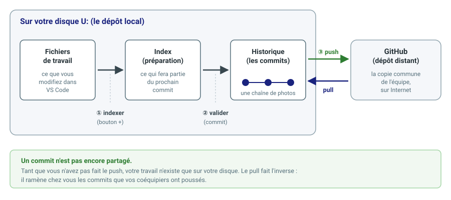

# Git et GitHub : comprendre le principe et créer son compte

*Contexte : BTS CIEL, travail en équipe sur des projets qui mêlent code
source, schémas et cartes électroniques. Les équipes travaillent dans
l'organisation GitHub `btsciel-toulon`.*

Ce document est le premier d'une série de trois :

| Document | Sujet |
|---|---|
| **doc1** (celui-ci) | Le principe de Git et de GitHub, création de votre compte |
| [doc2](doc2-travailler-en-projet.md) | L'organisation du travail en projet : équipes, dépôt, tableau Kanban |
| [doc3](doc3-git-dans-vscode.md) | Utiliser Git au quotidien depuis VS Code |

À faire **une seule fois dans l'année**, avant le premier projet. Comptez
trente minutes, dont dix pour lire.

---

## 1. Pourquoi versionner son travail

Vous avez sûrement déjà rencontré ce dossier :

```
rapport_final.docx
rapport_final_v2.docx
rapport_final_v2_corrigé.docx
rapport_final_v2_corrigé_VRAIMENT_final.docx
```

Ce n'est pas une fatalité, c'est le symptôme d'un outil manquant. Le
**contrôle de version** (*version control*) le remplace : il conserve
l'historique complet de votre travail, sans multiplier les copies.

Concrètement, il vous permet de :

- **revenir en arrière** quand une modification a tout cassé — votre programme
  marchait hier, plus aujourd'hui, et vous pouvez voir exactement ce qui a
  changé entre les deux ;
- **savoir qui a fait quoi, quand et pourquoi** — précieux quand un
  coéquipier a modifié la carte pendant votre absence ;
- **travailler à plusieurs** sur le même projet sans vous écraser
  mutuellement vos fichiers ;
- **avoir une sauvegarde** : votre travail existe ailleurs que sur un seul
  disque.

Dans vos projets, cela vaut pour le **code** (C, C++, Python), mais aussi pour
les **schémas et cartes** (fichiers Proteus), la **documentation** et les
fichiers de configuration. Tout ce qui est un fichier peut être versionné.

## 2. Git en cinq notions

**Git** est le logiciel de contrôle de version. Il fonctionne sur votre
poste, sans connexion Internet. Cinq notions suffisent pour démarrer.

| Notion | Ce que c'est |
|---|---|
| **Dépôt** (*repository*, ou *repo*) | Un dossier de projet suivi par Git : vos fichiers, plus leur historique complet. |
| **Commit** | Une « photo » de l'état du projet à un instant donné, accompagnée d'un message qui dit ce qui a changé et pourquoi. L'historique est une chaîne de commits. |
| **Dépôt distant** (*remote*) | Une copie du dépôt hébergée sur un serveur, que toute l'équipe partage. Ici, c'est GitHub. |
| **Push** (*pousser*) | Envoyer vos nouveaux commits vers le dépôt distant. |
| **Pull** (*tirer*) | Ramener chez vous les commits que vos coéquipiers ont poussés. |

Une dernière opération, qu'on fait une fois par projet : le **clone**, qui
consiste à récupérer chez vous une copie complète d'un dépôt distant.



Le cycle de travail est toujours le même :

1. vous **modifiez** des fichiers dans VS Code ;
2. vous choisissez ceux qui feront partie du commit : on dit que vous les
   **indexez** (*stage*) ;
3. vous **validez** : Git crée le commit, avec votre message ;
4. plus tard, vous **poussez** vos commits vers GitHub, pour les partager.

> **Un commit n'est pas un envoi.** Valider crée une photo *sur votre
> disque*. Tant que vous n'avez pas poussé, vos coéquipiers ne voient rien, et
> si votre disque est perdu, votre travail l'est aussi. C'est l'erreur la plus
> fréquente au début.

Le [doc3](doc3-git-dans-vscode.md) montre chacun de ces gestes dans VS Code.

## 3. GitHub, et ce qu'il ajoute à Git

**Git** est l'outil. **GitHub** est un service en ligne qui héberge des dépôts
Git et y ajoute de quoi organiser un travail d'équipe. Ce ne sont pas la même
chose : Git fonctionne sans GitHub, mais GitHub est ce qui vous permet de
partager.

Quatre notions GitHub reviennent dans tous vos projets.

| Notion | Ce que c'est | Chez nous |
|---|---|---|
| **Compte** | Votre identité personnelle sur GitHub. | Vous en créez un dans ce document. |
| **Organisation** | Un espace commun qui regroupe les dépôts et les personnes d'un même ensemble. | `btsciel-toulon`, celle du BTS. Vos dépôts y sont **privés** : seuls vous, votre équipe et vos professeurs les voient. |
| **Équipe** (*team*) | Un groupe de personnes de l'organisation. Elle reçoit des droits sur des dépôts précis. | Votre équipe de projet, constituée par votre professeur. Elle a le droit d'écrire dans son dépôt, et dans celui-là seulement. |
| **Dépôt** | Le projet lui-même, hébergé sur GitHub. | Un dépôt par équipe, créé pour vous à partir d'un modèle. |
| **Project** | Un tableau de suivi des tâches, de type **Kanban**, lié au dépôt. | Un tableau par équipe, avec les colonnes *à faire / en cours / terminé*. |

Vous n'avez rien à créer de tout cela : votre professeur constitue les équipes,
crée les dépôts et les tableaux. Vous devez seulement avoir **un compte
correctement configuré**, et c'est l'objet de la suite. Le [doc2](doc2-travailler-en-projet.md)
explique comment vous servir de tout cela.

## 4. Créer votre compte GitHub

### Avant de commencer : une règle qui ne souffre pas d'exception

> ⚠️ **Utilisez l'adresse e-mail que vous avez fournie à votre professeur.**
>
> C'est à cette adresse, et à aucune autre, que l'invitation à l'organisation
> `btsciel-toulon` a été envoyée. Un compte créé avec une autre adresse ne
> recevra rien, et personne ne pourra vous inviter tant que vous ne l'aurez
> pas corrigé.

Deuxième condition, tout aussi importante : **cette adresse doit être
configurée sur votre smartphone**, c'est-à-dire que vous devez y recevoir vos
messages en temps réel. Vous en aurez besoin dans les minutes qui suivent
pour :

- recevoir le **code de vérification** de la création du compte ;
- recevoir l'**invitation** à l'organisation ;
- plus tard, si vous oubliez votre mot de passe, recevoir le lien de
  réinitialisation.

Vérifiez avant de continuer : envoyez-vous un message de test et assurez-vous
qu'il arrive sur votre téléphone.

### Étape 1 — Créer le compte

1. Ouvrez [github.com/signup](https://github.com/signup).
2. Saisissez **l'adresse fournie à votre professeur**.
3. Choisissez un mot de passe **unique**, que vous n'utilisez nulle part ailleurs.
   Un gestionnaire de mots de passe est fortement recommandé.
4. Choisissez un **nom d'utilisateur** (*username*). Il sera visible de votre
   équipe et de vos professeurs, dans l'historique de chaque commit. Pour
   qu'il vous reste utile après le BTS, prenez-en un **sobre et
   reconnaissable** : par exemple `prenom-nom`. Évitez les surnoms qui ne
   vous représenteraient pas devant un employeur.
5. Résolvez le contrôle anti-robot.
6. GitHub envoie un **code à huit chiffres** à votre adresse : lisez-le sur
   votre smartphone et saisissez-le.

**Ce que vous devez voir :** la page d'accueil de GitHub, avec votre nom
d'utilisateur en haut à droite.

### Étape 2 — Vérifier votre adresse

Ouvrez votre profil (en haut à droite) → **Settings** → **Emails**. Votre
adresse doit apparaître avec la mention **Verified**.

> **Vous aviez déjà un compte GitHub ?** Inutile d'en créer un second. Sur la
> même page, ajoutez l'adresse fournie à votre professeur (**Add email
> address**), puis validez le message de vérification qui arrive sur votre
> smartphone. L'invitation sera reçue par votre compte existant.

### Étape 3 — Activer la double authentification

Elle protège votre compte, et donc le travail de votre équipe, même si votre
mot de passe est découvert. GitHub la demande d'ailleurs de plus en plus
souvent : autant la mettre en place tout de suite.

1. **Settings** → **Password and authentication** → **Two-factor
   authentication** → **Enable two-factor authentication**.
2. Choisissez **Authenticator app** et scannez le code affiché avec une
   application d'authentification de votre smartphone, ou utilisez
   l'application **GitHub Mobile**, qui peut jouer ce rôle.
3. Saisissez le code à six chiffres demandé pour confirmer.
4. GitHub affiche des **codes de récupération** (*recovery codes*).
   **Enregistrez-les hors de votre téléphone** — dans votre gestionnaire de mots
   de passe ou imprimés. Si vous perdez votre téléphone sans eux, vous perdez
   l'accès au compte.

## 5. Accepter l'invitation à l'organisation

Votre professeur a envoyé, ou enverra, une invitation à l'adresse fournie.

1. Sur votre smartphone (ou sur votre poste), ouvrez le message de GitHub
   intitulé *« … invited you to join the btsciel-toulon organization »*.
2. Cliquez sur **Join btsciel-toulon**. Vous devez être connecté à votre
   compte GitHub à ce moment-là.
3. Confirmez sur la page qui s'ouvre.

**Ce que vous devez voir :** la page de l'organisation `btsciel-toulon`, et
celle-ci apparaît dans la liste de votre profil → **Your organizations**.

> **L'invitation expire au bout de sept jours.** Passé ce délai, elle ne
> fonctionne plus : prévenez votre professeur, qui la renverra.

Vous ne verrez pas encore de dépôt dans l'organisation : les équipes de projet
et leurs dépôts sont créés plus tard par votre professeur. Vous ne verrez que
ceux de votre équipe, jamais ceux des autres.

## 6. Vérifier Git et vous identifier

Git doit être installé sur le poste où vous travaillez. Ouvrez un terminal
PowerShell (menu Démarrer, tapez « PowerShell »), puis :

```
git --version
```

**Ce que vous devez voir :** un numéro de version, par exemple
`git version 2.47.0.windows.1`.

- **Poste de la salle :** si vous voyez une erreur *« terme non reconnu »*,
  signalez-le à votre professeur.
- **Votre ordinateur personnel :** installez Git depuis
  [git-scm.com/install/windows](https://git-scm.com/install/windows), en gardant
  les options proposées par défaut. Fermez puis rouvrez PowerShell avant de
  retester.

Ensuite, dites à Git **qui vous êtes**. Ces deux informations sont inscrites
dans chacun de vos commits. Utilisez **la même adresse que celle de votre
compte GitHub**, pour que vos commits soient rattachés à votre profil :

```
git config --global user.name "Prénom Nom"
```

```
git config --global user.email "adresse.fournie@au.professeur"
```

Vérifiez :

```
git config --global --list
```

**Ce que vous devez voir :** vos deux lignes `user.name` et `user.email`.

## 7. En cas de problème

| Symptôme | Cause | Que faire |
|---|---|---|
| Le code de vérification n'arrive pas | Adresse mal saisie, ou message dans les courriers indésirables | Vérifiez l'orthographe, regardez le dossier *spam*, puis redemandez un code |
| L'invitation n'arrive jamais | Compte créé avec une autre adresse, ou adresse non vérifiée | **Settings → Emails** : l'adresse fournie doit être présente et *Verified* |
| L'invitation ne fonctionne plus | Elle date de plus de sept jours | Prévenez votre professeur |
| *« Page not found »* en cliquant sur l'invitation | Vous êtes connecté avec un autre compte GitHub | Déconnectez-vous, puis reconnectez-vous avec le bon compte |
| `git` : *terme non reconnu* | Git non installé, ou PowerShell ouvert avant l'installation | Fermez et rouvrez PowerShell ; sinon reprenez l'installation |

## 8. À retenir

- **Git** est l'outil de suivi de versions, sur votre poste. **GitHub** est le
  service qui héberge les dépôts et permet de les partager.
- Un **commit** est une photo de votre projet, sur votre disque. Il n'est
  partagé qu'après un **push**.
- Votre compte GitHub doit être créé avec **l'adresse fournie à votre
  professeur**, et cette adresse doit être **configurée sur votre smartphone**.
- Activez la **double authentification** et gardez vos **codes de
  récupération** en lieu sûr, hors du téléphone.
- L'invitation à `btsciel-toulon` expire au bout de **sept jours**.
- Git doit connaître votre nom et votre adresse (`user.name` et `user.email`)
  avant votre premier commit.

**Suite :** [doc2 — Travailler en projet](doc2-travailler-en-projet.md).
