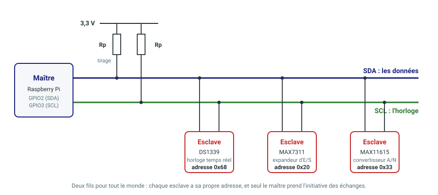
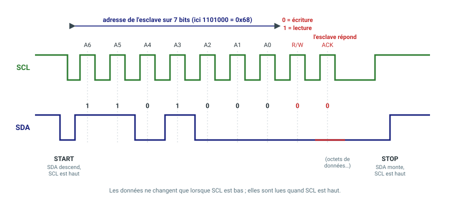
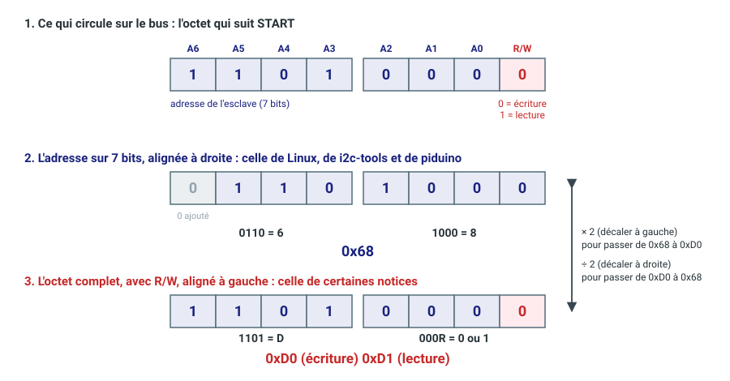

# Le bus I²C : principe, adresses, et les outils i2c-tools

Le bus I²C (prononcer « I deux C », pour *Inter-Integrated Circuit*) permet à
un processeur de dialoguer avec plusieurs composants — horloge temps réel,
convertisseur analogique-numérique, expandeur d'entrées-sorties, capteurs — en
n'utilisant que **deux fils**. Ce document présente son principe, ses signaux,
le piège classique de l'adresse sur 7 bits, puis montre comment activer le bus
sur une Raspberry Pi et l'explorer avec les `i2c-tools`.

## 1. Le principe

Le bus est formé de deux lignes, partagées par tous les composants :

- **SDA** (*Serial DAta*) : les données ;
- **SCL** (*Serial CLock*) : l'horloge.



- **Un maître, plusieurs esclaves.** Le maître (ici la Raspberry Pi) est le seul
  à produire l'horloge SCL et à prendre l'initiative des échanges. Les esclaves
  répondent quand on leur parle.
- **Chaque esclave a une adresse.** Le maître désigne l'esclave avec lequel il
  veut parler en envoyant son adresse : deux composants sur le même bus ne
  doivent donc pas avoir la même.
- **Les lignes sont à « collecteur ouvert ».** Aucun composant n'impose de
  niveau haut : chacun sait seulement **tirer la ligne vers 0 V**. C'est une
  **résistance de tirage** (*pull-up*) reliée à 3,3 V qui ramène la ligne au
  niveau haut quand plus personne ne la tire. Cela évite qu'un composant qui
  veut un 1 et un autre qui veut un 0 se court-circuitent.
- **Vitesse.** Le bus fonctionne à 100 kHz (mode standard) ou 400 kHz (mode
  rapide) ; par défaut, la Raspberry Pi utilise 100 kHz.

Sur une Raspberry Pi, SDA est la broche **GPIO2** (broche 3 du connecteur) et
SCL la broche **GPIO3** (broche 5). Ces broches ne supportent que **3,3 V**, ne
les reliez jamais à un bus en 5 V. La carte porte déjà des résistances de
tirage sur ces deux broches (1,8 kΩ) : inutile d'en ajouter. Sur un Compute
Module, elles dépendent de la carte porteuse : consultez son schéma.

## 2. Les signaux

Tout échange commence par une **condition START** et se termine par une
**condition STOP**, produites par le maître. Entre les deux, les octets sont
transmis bit à bit, le bit de poids fort en premier.



- **START** : SDA passe du niveau haut au niveau bas **pendant que SCL est
  haut**. C'est la seule fois, avec STOP, où SDA change alors que SCL est haut.
- **Bits de données** : SDA ne change que **quand SCL est bas**. Le
  récepteur lit SDA **quand SCL est haut**.
- **Acquittement (ACK)** : après chaque octet (8 bits), le récepteur tire SDA à
  0 V pendant un neuvième coup d'horloge pour dire « bien reçu ». Si personne ne
  répond (SDA reste haut, c'est un NACK), c'est que l'esclave n'existe pas ou
  qu'il n'a pas compris.
- **STOP** : SDA passe du niveau bas au niveau haut **pendant que SCL est
  haut**.

Le premier octet après START contient l'**adresse de l'esclave** sur 7 bits,
suivie du bit **R/W** : 0 pour écrire vers l'esclave, 1 pour lire depuis lui.

Un composant contient en général des **registres**, repérés par un numéro.
Pour écrire ou lire un registre, le maître envoie donc l'adresse de l'esclave,
puis le numéro du registre :

| Opération | Trame |
|---|---|
| Écrire un registre | START, adresse + W, ACK, numéro du registre, ACK, donnée, ACK, STOP |
| Lire un registre | START, adresse + W, ACK, numéro du registre, ACK, **START répété**, adresse + R, ACK, donnée lue, NACK du maître, STOP |

Pour la lecture, le maître doit d'abord indiquer *quel* registre il veut lire
(donc une écriture), puis relancer un START (sans STOP entre les deux) pour
passer en lecture. À la fin d'une lecture, c'est le maître qui répond NACK :
il signale à l'esclave que c'était le dernier octet.

## 3. L'adresse sur 7 bits, et le piège de l'alignement

L'adresse d'un composant tient sur **7 bits** (de 0x00 à 0x7F). Comme un octet
en compte 8, l'octet envoyé sur le bus se compose ainsi : les 7 bits d'adresse
**suivis du bit R/W**, donc l'adresse est décalée d'un bit vers la gauche.



Or les documents ne notent pas tous cette adresse de la même façon :

- **Adresse sur 7 bits, alignée à droite** : on ajoute un 0 devant pour compléter
  l'octet et on lit l'hexadécimal, ce qui donne ici **0x68**. C'est la
  convention de **Linux**, des **i2c-tools**, de la bibliothèque **piduino** et
  de la bibliothèque Arduino `Wire`.
- **Octet complet avec R/W, aligné à gauche** : certaines notices (et certains
  analyseurs logiques) donnent l'adresse avec le bit R/W, en hexadécimal : **0xD0**
  pour l'écriture et **0xD1** pour la lecture. C'est le même composant, mais la
  valeur est le double.

C'est le piège : **deux valeurs hexadécimales différentes désignent le même
composant**. Si vous donnez 0xD0 à `i2cdetect`, vous parlez à un autre composant
(ou à aucun). Il faut toujours savoir dans quelle convention la notice
exprime l'adresse.

| Composant | Adresse 7 bits (Linux) | Octet en écriture | Octet en lecture |
|---|---|---|---|
| DS1339 (horloge temps réel) | 0x68 | 0xD0 | 0xD1 |
| MAX7311 (expandeur d'E/S) | 0x20 | 0x40 | 0x41 |
| MAX11615 (convertisseur A/N) | 0x33 | 0x66 | 0x67 |

Pour convertir :

- 8 bits → 7 bits : **diviser par 2** (décaler d'un bit vers la droite) ;
- 7 bits → 8 bits : **multiplier par 2** (décaler d'un bit vers la gauche),
  puis ajouter 1 pour l'octet de lecture.

Un réflexe utile : une adresse **supérieure à 0x77** ne peut pas être une adresse
sur 7 bits utilisable : c'est très probablement un octet avec R/W. Il faut la
diviser par 2. Les adresses de 0x00 à 0x07 et de 0x78 à 0x7F sont d'ailleurs
**réservées** par la norme.

## 4. Activer le bus I²C sur la Raspberry Pi

Le bus est désactivé par défaut. On l'active avec l'outil de configuration
`raspi-config` de Raspberry Pi OS :

```bash
sudo raspi-config
```

1. Choisissez **Interface Options** (« 3 Interface Options »).
2. Choisissez **I2C**.
3. Répondez **Yes** à la question « Would you like the ARM I2C interface to be
   enabled? », puis validez avec **OK**.
4. Quittez avec **Finish**. Si `raspi-config` propose de redémarrer, acceptez ;
   sinon redémarrez la carte avec `sudo reboot`.

Après le redémarrage, le bus est accessible par un fichier de périphérique :

```bash
ls /dev/i2c-*
```

Vous devez voir **`/dev/i2c-1`** : c'est le bus sur GPIO2 et GPIO3, ce qu'on
désigne par « le bus 1 » dans les commandes qui suivent. `raspi-config` a aussi
chargé le module noyau nécessaire (`i2c-dev`).

L'utilisateur doit appartenir au groupe `i2c` pour accéder au bus (c'est le cas
de l'utilisateur créé à l'installation de Raspberry Pi OS) ; sinon il faut faire
précéder les commandes de `sudo`.

### La fréquence du bus

Par défaut, le bus fonctionne à **100 kHz** (mode standard). Certains composants
et certaines applications demandent 400 kHz (mode rapide). `raspi-config` ne
propose pas de régler la fréquence : il faut modifier le fichier de
configuration, `/boot/firmware/config.txt` (`/boot/config.txt` sur les versions
plus anciennes de Raspberry Pi OS). `raspi-config` y a ajouté la ligne :

```
dtparam=i2c_arm=on
```

Pour passer à 400 kHz, complétez cette ligne avec le paramètre de fréquence, en
hertz :

```
dtparam=i2c_arm=on,i2c_arm_baudrate=400000
```

Redémarrez ensuite la carte. Tous les composants du bus doivent supporter la
fréquence choisie (voir leurs notices) : si l'un d'eux ne la supporte pas, le
plus prudent est de rester à 100 kHz.

### Vérifier la configuration des broches avec `pido`

Une fois le bus activé, on peut vérifier que les broches 3 et 5 du connecteur
(GPIO2 et GPIO3) sont bien configurées pour l'I²C, et non en simples
entrées-sorties. La commande `pido` de piduino (voir
[pido](../../ressources/piduino/pido.md)) affiche l'état de toutes les broches :

```bash
pido readall
```

Le tableau reprend la disposition du connecteur : les broches impaires à
gauche, les broches paires à droite. Les colonnes utiles sont :

| Colonne | Contenu |
|---|---|
| `sOc` | numéro de la broche pour le processeur (2 pour GPIO2, 3 pour GPIO3) |
| `iNo` | numéro de la broche pour piduino |
| `Name` | nom de la fonction actuellement affectée à la broche |
| `Mode` | mode de la broche : `IN`, `OUT`, `OFF` ou une fonction alternative `ALT0`… `ALT9` |
| `Ph` | numéro de la broche sur le connecteur |

Cherchez les lignes dont la colonne `Ph` vaut **3** et **5** :

- sur une Raspberry Pi 1 à 4, le `Name` doit être **`SDA1`** (broche 3) et
  **`SCL1`** (broche 5), avec le `Mode` **`ALT0`** ;
- sur une Raspberry Pi 5 ou un Compute Module 5, le `Name` doit être
  **`I2C1SDA`** et **`I2C1SCL`**, avec le `Mode` **`ALT3`**.

Si le `Mode` est `IN`, `OUT` ou `OFF`, la broche n'est pas connectée au
contrôleur I²C : le bus n'est pas activé, ou vous n'avez pas redémarré après
avoir modifié `config.txt`. Reprenez les étapes précédentes.

## 5. Les i2c-tools

Ce paquet fournit des commandes pour explorer et tester le bus sans écrire de
programme. On l'installe avec :

```bash
sudo apt install i2c-tools
```

Les exemples supposent la carte d'extension utilisée en TP, sur laquelle sont
connectés l'horloge temps réel DS1339 (0x68), l'expandeur MAX7311 (0x20) et le
convertisseur MAX11615 (0x33).

### Lister les bus et scanner un bus

```bash
i2cdetect -l
```

liste les bus disponibles. Pour **scanner le bus 1** et voir quels composants
répondent :

```bash
i2cdetect -y 1
```

Le `1` est le numéro du bus, l'option `-y` évite la demande de confirmation. La
commande interroge chaque adresse et affiche une grille :

```
     0  1  2  3  4  5  6  7  8  9  a  b  c  d  e  f
00: -- -- -- -- -- -- -- -- -- -- -- -- -- -- -- -- 
10: -- -- -- -- -- -- -- -- -- -- -- -- -- -- -- -- 
20: 20 -- -- -- -- -- -- -- -- -- -- -- -- -- -- -- 
30: -- -- -- 33 -- -- -- -- -- -- -- -- -- -- -- -- 
40: -- -- -- -- -- -- -- -- -- -- -- -- -- -- -- -- 
50: -- -- -- -- -- -- -- -- -- -- -- -- -- -- -- -- 
60: -- -- -- -- -- -- -- -- 68 -- -- -- -- -- -- -- 
70: -- -- -- -- -- -- -- --
```

Chaque case est une adresse **sur 7 bits** (ligne : chiffre de gauche, colonne :
chiffre de droite) :

- une **adresse** (`20`, `33`, `68`) : un composant a répondu ;
- **`--`** : personne n'a répondu ;
- **`UU`** : l'adresse est déjà utilisée par un **pilote du noyau** (par exemple
  l'horloge temps réel, si elle est déclarée dans la configuration). Les
  commandes suivantes refusent alors d'y accéder sans l'option `-f`, à utiliser
  avec précaution.

Le scan ne teste que les adresses de 0x03 à 0x77. C'est un bon premier
diagnostic : si le composant n'apparaît pas, le problème vient du câblage, de
l'alimentation, des résistances de tirage ou de l'adresse.

### Lire un registre

```bash
i2cget -y 1 0x68 0x00
```

Les paramètres, dans l'ordre : le **bus** (1), l'**adresse du composant** sur 7
bits (0x68), le **numéro du registre** (0x00). On obtient par exemple :

```
0x42
```

Ce composant est une horloge temps réel : le registre 0x00 contient les
secondes. Elles sont codées en **BCD** (décimal codé binaire) : chaque chiffre
hexadécimal est un chiffre décimal. 0x42 se lit donc **42 secondes**, et non 66.

Sans le numéro de registre, `i2cget` lit l'octet courant. Par défaut il lit un
octet ; on peut lire un mot de 16 bits en ajoutant `w` en dernier argument.

### Écrire dans un registre

```bash
i2cset -y 1 0x68 0x07 0x25
```

Paramètres : le bus, l'adresse du composant, le numéro du registre, la valeur à
écrire. Pour vérifier, on relit le registre :

```bash
i2cget -y 1 0x68 0x07
```

On obtient `0x25`. Le registre 0x07 est celui des secondes de l'alarme 1 de
l'horloge temps réel : l'écrire est sans danger tant que l'alarme n'est pas
activée dans le registre de contrôle. **N'écrivez pas au hasard** : `i2cset` peut
modifier n'importe quel registre de n'importe quel composant, y compris la
configuration d'un capteur ou le contenu d'une mémoire.

### Lire tous les registres d'un composant

```bash
i2cdump -y 1 0x68
```

affiche les registres du composant sous forme de tableau hexadécimal, seize par
ligne. Pratique pour repérer les registres qui changent ou pour vérifier le
contenu après une écriture.

### Récapitulatif

| Commande | Rôle |
|---|---|
| `i2cdetect -l` | lister les bus |
| `i2cdetect -y 1` | scanner le bus 1 |
| `i2cget -y 1 0x68 0x00` | lire le registre 0x00 du composant d'adresse 0x68 |
| `i2cset -y 1 0x68 0x07 0x25` | écrire 0x25 dans le registre 0x07 |
| `i2cdump -y 1 0x68` | afficher tous les registres du composant |

Dans toutes ces commandes, l'adresse est l'adresse **sur 7 bits**, écrite en
hexadécimal avec le préfixe `0x`.

## 6. À retenir

- Le bus I²C n'utilise que deux fils, **SDA** et **SCL**, tirés au niveau haut
  par des résistances. Un maître dialogue avec plusieurs esclaves, chacun
  identifié par une **adresse**.
- Un échange commence par **START** et se termine par **STOP** ; chaque octet est
  suivi d'un **acquittement** de son récepteur.
- L'adresse tient sur **7 bits**. Certaines notices donnent l'octet complet
  avec le bit R/W (donc le double, par exemple 0xD0 au lieu de 0x68) : **Linux,
  les i2c-tools et piduino utilisent l'adresse sur 7 bits**.
- Pour activer le bus : `sudo raspi-config` (Interface Options, I2C), redémarrer,
  et vérifier la présence de `/dev/i2c-1` puis la configuration des broches
  avec `pido readall`. La fréquence par défaut est de 100 kHz ; on la modifie
  dans `config.txt` avec `i2c_arm_baudrate`.
- `i2cdetect -y 1` pour scanner, `i2cget` pour lire un registre, `i2cset` pour
  l'écrire, `i2cdump` pour afficher tous les registres.
