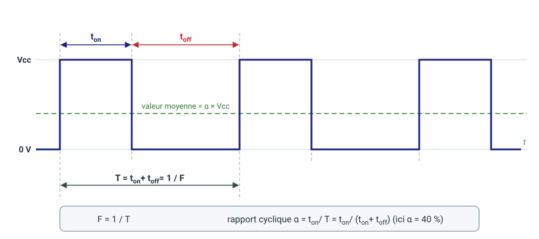

# Le signal PWM

*PWM = **P**ulse **W**idth **M**odulation, en français « modulation de largeur
d'impulsion ».*

Une broche GPIO ne sait sortir que deux niveaux : **0 V** ou **Vcc** (3,3 V sur
une Raspberry Pi). Pour commander la luminosité d'une LED, la vitesse d'un
moteur ou la position d'un servomoteur, il faudrait pourtant une tension
*intermédiaire*. Le signal PWM permet d'y arriver avec une sortie qui reste
strictement numérique.

## 1. Le principe

Un signal PWM est un **signal rectangulaire de fréquence fixe** dont on fait
varier la **durée à l'état haut**. On ne change pas la cadence, on change la
part de chaque cadence passée à l'état haut.



## 2. Les grandeurs qui le caractérisent

| Grandeur | Signification | Relation |
|---|---|---|
| **T** | Période : durée d'un cycle complet | T = ton + toff |
| **F** | Fréquence : nombre de cycles par seconde | F = 1 / T |
| **ton** | Durée pendant laquelle le signal est à l'état haut (Vcc) | 0 ≤ ton ≤ T |
| **toff** | Durée pendant laquelle le signal est à l'état bas (0 V) | toff = T − ton |
| **α** | **Rapport cyclique** (*duty cycle*) | α = ton / T |

Le rapport cyclique s'exprime en pourcentage :

- α = 0 % : le signal reste en permanence à 0 V ;
- α = 50 % : signal carré, autant de temps à l'état haut qu'à l'état bas ;
- α = 100 % : le signal reste en permanence à Vcc.

La **valeur moyenne** du signal vaut α × Vcc. C'est elle que « voit » un
récepteur lent : l'œil ne distingue pas une LED qui clignote à 1 kHz et la voit
simplement plus ou moins brillante ; un moteur, par son inertie, tourne à une
vitesse qui dépend de cette moyenne. Sur le schéma, α = 40 % donne une valeur
moyenne de 0,4 × Vcc, soit 1,32 V pour Vcc = 3,3 V.

> Fréquence et rapport cyclique sont deux réglages **indépendants** : la
> fréquence dit à quelle cadence on répète le cycle, le rapport cyclique dit ce
> qu'on y met. Selon le récepteur, c'est l'un ou l'autre qui compte — pour une
> LED, on choisit une fréquence assez élevée pour éviter le scintillement et on
> fait varier α ; pour un servomoteur, la fréquence est imposée (50 Hz) et c'est
> la durée ton qui code la position.

## 3. Comment le signal est généré

On ne génère pas un signal PWM en programmant des attentes dans le code :
la précision serait médiocre et le processeur serait mobilisé en permanence.
Le signal est produit par un **circuit timer** (temporisateur) matériel, qui
fonctionne tout seul une fois configuré.

Son cœur est un **compteur** de *n* bits, alimenté par l'horloge `FclkIO`
(éventuellement divisée par un **prédiviseur** `div`) et qui repart de zéro à
la fin de chaque période. Trois valeurs le règlent :

1. **La période T** est la durée d'un tour du compteur. On la programme sous
   la forme d'un nombre de pas, la valeur **range**, qui ne peut pas dépasser
   la capacité du compteur :

   **range ≤ 2ⁿ**

   Le compteur met `range` pas à faire un tour, et chaque pas dure
   `div / FclkIO`. La fréquence du signal est donc :

   **F = FclkIO / (div × range)**

   Dans le cas particulier `div` = 1 et `range` = 2ⁿ (le compteur fait un tour
   complet), on retrouve la division de FclkIO par 2ⁿ : F = FclkIO / 2ⁿ.
   C'est la fréquence **maximale** que l'on peut obtenir avec *n* bits.

2. **La durée ton** est un nombre de pas compris entre **0 et range**. Le
   timer compare en permanence le compteur à cette valeur : la sortie est à
   l'état haut tant que le compteur est inférieur à ton, puis passe à l'état
   bas jusqu'à la fin du tour.

   **α = ton / range**

3. **Le prédiviseur `div`** permet d'obtenir des fréquences plus basses sans
   toucher à `range`. C'est ce qui rend **F et range indépendants** : `range`
   fixe la résolution du réglage de α, `div` ajuste la fréquence.

Changer le rapport cyclique revient à écrire une seule valeur, `ton`, dans un
registre du timer. Le signal change de forme à la période suivante, sans
intervention du programme.

### Régler F et range avec `pido`

Sur une Raspberry Pi, `pido` (voir [pido](../../ressources/piduino/pido.md))
règle les paramètres du timer matériel avec trois commandes :

```bash
pido mode <pin> pwm        # place la broche en mode PWM
pido pwmr <pin> 1024       # range = 1024
pido pwmf <pin> 1000       # F = 1000 Hz (approximativement)
pido pwm <pin> 256         # ton = 256, soit α = 256 / 1024 = 25 %
```

Le programme ne demande pas le prédiviseur : il le **calcule** à partir de la
fréquence souhaitée et du `range` courant, en arrondissant à l'entier
supérieur :

**div = ⌈ FclkIO / (F × range) ⌉**

Le prédiviseur étant un entier, la fréquence obtenue n'est pas exactement
celle demandée : `pido pwmf <pin>` affiche la valeur réellement obtenue. Sur
les cartes Broadcom, l'arrondi se fait vers le haut, donc la fréquence obtenue
est **inférieure ou égale** à celle demandée.

| Carte | SoC | FclkIO |
|---|---|---|
| Raspberry Pi 1, 2, 3, Zero | BCM2835, BCM2836, BCM2837 | 19,2 MHz |
| Raspberry Pi 4 | BCM2711 | 54 MHz |
| Raspberry Pi 5 | BCM2712 (contrôleur PWM dans la puce RP1) | 50 MHz |

Exemple sur une Raspberry Pi 4, avec `range` = 1024 et F = 1000 Hz demandés :

- div = ⌈ 54 000 000 / (1000 × 1024) ⌉ = ⌈ 52,73 ⌉ = **53** ;
- F obtenue = 54 000 000 / 53 / 1024 ≈ **995 Hz**, soit T ≈ 1,005 ms ;
- ton = 256 donne α = 25 % : la broche reste à l'état haut 256 pas sur 1024.

> **Attention à l'ordre des réglages.** `pido pwmf` calcule le prédiviseur avec
> le `range` *au moment où on l'appelle*. Si vous changez `range` ensuite, le
> prédiviseur ne bouge pas et la fréquence change. Réglez donc d'abord `range`
> (`pwmr`), puis la fréquence (`pwmf`).

### Le compromis résolution / fréquence

`range` est aussi le **nombre de valeurs** de ton, donc la **résolution** du
rapport cyclique : avec `range` = 1024, on règle α par pas de 1/1024 (≈ 0,1 %).

Or F = FclkIO / (div × range) : pour une fréquence donnée, `range` ne peut pas
dépasser FclkIO / (div_min × F). **Plus la fréquence est élevée, moins il reste
de pas dans une période**, et moins α se règle finement. Sur une Raspberry Pi 4
(FclkIO = 54 MHz, prédiviseur minimal 2), un signal à 20 kHz est limité à
`range` ≤ 54 000 000 / 2 / 20 000 = 1350 pas.

## 4. Obtenir une tension continue à partir d'un signal PWM

Un signal PWM est numérique, mais sa **valeur moyenne** est analogique :
α × Vcc. Pour la récupérer, il suffit de supprimer le rythme du signal et de ne
garder que sa moyenne, c'est-à-dire de le faire passer dans un **filtre
passe-bas**. Le plus simple est une cellule RC : une résistance en série, un
condensateur vers la masse, et la tension continue est prélevée aux bornes du
condensateur.


Le filtre se caractérise par sa constante de temps **τ = R·C**, ou par sa
fréquence de coupure **fc = 1 / (2π·R·C)**. Pour que la cellule laisse passer
la moyenne et arrête le signal, il faut choisir **fc très inférieure à F**.

### Exemple

Vcc = 3,3 V, F = 5 kHz (T = 200 µs) et une ondulation résiduelle de 20 mV
crête à crête au plus.

Le condensateur se charge pendant ton et se décharge pendant toff : la
tension de sortie oscille en triangle autour de la valeur moyenne. Cette
ondulation vaut :

**ΔV ≈ Vcc × α(1 − α) × T / τ**

Elle est maximale pour α = 50 % : ΔV = Vcc × T / (4τ). Il faut donc
τ ≥ 3,3 × 200 µs / (4 × 20 mV) = 8,25 ms. On retient **R = 1 kΩ** et
**C = 10 µF**, soit τ = 10 ms, fc ≈ 16 Hz et une ondulation d'environ 16 mV.

La charge branchée sur la sortie doit avoir une impédance d'entrée très
supérieure à R (au moins 100 fois, donc ici ≥ 100 kΩ), sinon elle forme avec R
un pont diviseur qui abaisse la tension. Avec une charge moins favorable, on
intercale un suiveur à amplificateur opérationnel.

### Le compromis ondulation / temps de réaction

Le filtre a deux défauts qui vont dans des sens opposés :

- **L'ondulation** diminue quand τ augmente : ΔV = Vcc × T / (4τ) ;
- **le temps de réaction** augmente avec τ : après un changement de rapport
  cyclique, la sortie atteint sa valeur finale à 1 % près au bout de
  **4,6 × τ** environ.

Améliorer l'un dégrade l'autre. Pour une cellule RC, leur produit ne dépend pas de R ni de C :

**ΔV × t₁% ≈ 1,15 × Vcc × T**

Avec les valeurs de l'exemple : 16 mV × 46 ms ≈ 0,76 V·ms, quelle que soit la
combinaison R et C choisie. Pour une ondulation dix fois plus faible, il faut
donc accepter un filtre dix fois plus lent. Une cellule RC ne permet pas de
sortir de ce compromis.

### Pour aller plus loin

Plusieurs pistes permettent de s'en écarter.

- **Augmenter la fréquence F.** Le produit ci-dessus est proportionnel à T :
  doubler F divise par deux l'ondulation à temps de réaction égal. La
  contrepartie est la résolution : `range` ≈ FclkIO / F diminue, et avec lui le
  nombre de valeurs de α (voir la section 3).
- **Augmenter l'ordre du filtre.** Un filtre du second ordre atténue à
  40 dB par décade au lieu de 20 : l'ondulation est proportionnelle à (f₀ / F)² au
  lieu de fc / F. Le montage classique est le filtre actif de **Sallen-Key** (schéma
  ci-dessus) : deux résistances, deux condensateurs et un seul amplificateur
  opérationnel monté en suiveur. Avec deux résistances égales, sa fréquence de
  coupure est f₀ = 1 / (2π·R·√(C₁·C₂)) et le rapport C₁ / C₂ fixe son
  amortissement : C₁ ≈ 2·C₂ donne Q ≈ 0,7, la réponse de **Butterworth**. En
  simulation, avec R = 1 kΩ, C₁ = 680 nF et C₂ = 330 nF (f₀ ≈ 336 Hz), on
  obtient 18 mV d'ondulation, soit autant que la cellule RC de l'exemple
  (16 mV), mais la valeur finale est atteinte à 3 % près en 2,6 ms au lieu de
  37 ms : environ 14 fois plus vite. La contrepartie est un dépassement
  d'environ 5 % lors d'un changement de rapport cyclique. On peut aussi monter à
  des ordres supérieurs en mettant plusieurs étages en cascade.
- **Choisir la réponse du filtre.** À ordre égal, le rapport C₁ / C₂ (le
  facteur de qualité Q) arbitre entre rapidité et dépassement. Un filtre de
  **Butterworth** offre une bande passante plate et une atténuation franche, un
  filtre de **Bessel** a la meilleure réponse à un échelon (peu de dépassement)
  mais atténue moins vite, un filtre de **Tchebychev** atténue plus vite au
  prix d'une ondulation dans la bande passante et de dépassements plus forts.
  Un filtre **elliptique** ou un **coupe-bande accordé sur F** élimine
  spécifiquement la fréquence du signal PWM.
- **Précompenser la commande.** Le logiciel connaît τ : pour atteindre vite
  une nouvelle valeur, il peut imposer temporairement un rapport cyclique plus
  extrême (jusqu'à 0 % ou 100 %) pendant une durée calculée, puis revenir à la
  valeur visée. Le filtre reste lent, mais la sortie n'a plus à attendre.
- **Changer de modulation.** À rapport cyclique égal, une modulation par
  **densité d'impulsions** (PDM, *sigma-delta*) répartit l'énergie de
  l'ondulation vers les hautes fréquences, où un filtre simple l'atténue bien
  mieux. Le RP1 du Raspberry Pi 5 et du CM5 sait la générer en matériel, mais
  piduino n'exploite que le mode PWM classique.
- **Passer à un vrai convertisseur.** Si l'on a besoin à la fois d'une
  ondulation très faible et d'une réponse rapide, un CNA externe (I²C ou SPI)
  reste le bon outil.
